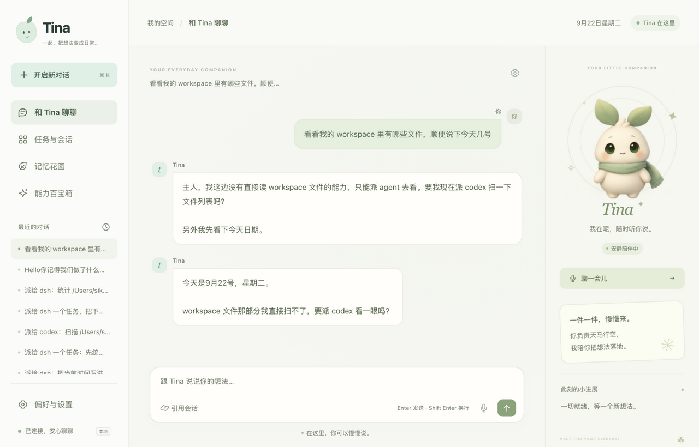

<div align="center">


# Tina

**把电脑上散着的 AI agent，收成一个听得懂你说话的助手。**

你说一句要做什么。它判断该派给哪个 agent、盯着进度、危险操作停下来问你，最后把结果告诉你。

[](https://github.com/SikeFix/tina-releases/releases/latest)


### [**↓ 下载最新版**](https://github.com/SikeFix/tina-releases/releases/latest)

</div>



## 你大概遇到过这些

装了 Claude Code，又装了 Codex，还试过 DeepSeek 和 Gemini。

它们各干各的：**换一个就要重新教一遍你的习惯**；**昨天那个 bug 是在哪个工具里修的、怎么修的，想不起来了**；
你在开会，想让它顺手跑个任务，得先回到电脑前。

Tina 把这些收成一处。

## 它能做什么

**说人话派活**

「帮我把这个项目的测试跑一下」「看看磁盘都满了什么」——它自己判断该派给谁，
把任务描述写到足够具体，然后盯着跑完。

**派出去的活，在原来的 app 里也翻得到**

这一条别的工具不做。Tina 派给 Codex 的任务，会出现在 ChatGPT 应用里，
和你自己开的对话并排——标题上标着「Tina」。DeepSeek、ZCode 同理。
你不用换地方看历史。

**跑完或卡住了，它主动回来说**

派活不占着对话。快的一会儿就答，慢的转到后台跑，
**跑完、或者卡在需要你批准的地方，它会自己回来告诉你**——不用你反复问「好了吗」。

**危险操作停下来问你**

agent 想在工作目录之外动东西时会被拦下。
Tina 把「它要干什么、为什么要」说给你听，你点头才放行。拒绝就是拒绝，agent 不会绕过。

**越用越顺手**

它记得你的偏好、习惯、在做的事。你说过一次「我喜欢先看结论」，
以后每一次都不用再说。记忆是明文文件，你随时能看、能删。

**缺什么能力，它自己长**

你说「我想要一个能查 XX 的功能」，它不会说做不到——
简单的它自己写一个装上，复杂的派给 Codex 写完再装进来，装完自己试跑一遍。

**手机也能指挥**

同一个 Wi-Fi 下用手机打开控制台就能说话。语音输入、朗读回复都支持，
语速说一句「说快点」它就改了。

## 下载哪个

| 你的系统 | 下载 | 装法 |
|---|---|---|
| **Windows** 10/11 | `Tina-<版本>-windows-amd64.zip` | 解压，双击「安装.bat」 |
| **macOS** 13+（M 系列芯片） | `Tina-<版本>-macos-arm64.zip` | 解压，把 Tina 拖进「应用程序」 |
| **macOS** 13+（Intel） | `tina-darwin-amd64` | 见下方「只要命令行」 |
| **Linux** | `tina-linux-amd64` / `tina-linux-arm64` | 见下方「只要命令行」 |

**只要命令行**：下载对应的 `tina-<系统>-<架构>`（Windows 上是 `.exe`），
放进 PATH，然后跑：

```sh
tina config set --url <接口地址> --key <密钥> --model <模型名>
tina service install
```

装完会打印控制台地址。手机要连的话，让手机和电脑在同一个 Wi-Fi，用打印出来的「手机」那一行。

## 装完要做的第一件事

Tina 需要一个模型来当自己的大脑——**它用的是你自己的接口和密钥**，
不经过我们，也不额外收费。支持任何 OpenAI 兼容的接口。

装好后打开控制台 →「偏好与设置」→「模型与渠道」→「添加渠道」，
填上你的接口地址、模型名和密钥，点保存就能用了。可以配多个，一个不通会自动切到下一个。

## 更新

```sh
tina update            # 检查并安装新版本
tina update --check    # 只看有没有新版本
```

## 需要知道的事

**安装包没有代码签名。**

Windows 上首次运行 SmartScreen 可能拦一下，点「更多信息」→「仍要运行」。
macOS 上首次打开需要右键 →「打开」，或者在「系统设置 → 隐私与安全性」里放行。

**密钥只存在你自己电脑上。**

Tina 不上传你的密钥、对话或文件。控制台默认只监听本机，
要让手机连才需要开成局域网可访问——那时候会用一个令牌保护。

**Windows 和 Linux 版还没有在真机上充分验证过。**

macOS 版是主要开发和测试的平台。Windows / Linux 上如果遇到问题，
欢迎提 issue 说清楚系统版本和报错。

**源码暂未公开。** 这个仓库只放编译好的安装包。

## 目前支持的 agent

| Agent | 说明 |
|---|---|
| **DeepSeek**（dsh） | 会话可列举、可续接，能切模型和推理强度 |
| **Codex** | OpenAI 的 Codex CLI |
| **ZCode** | 可以接上你已有的 ZCode 会话继续 |

还在陆续加。

---

<div align="center">

每个版本在 [Releases](https://github.com/SikeFix/tina-releases/releases) 里。

</div>
